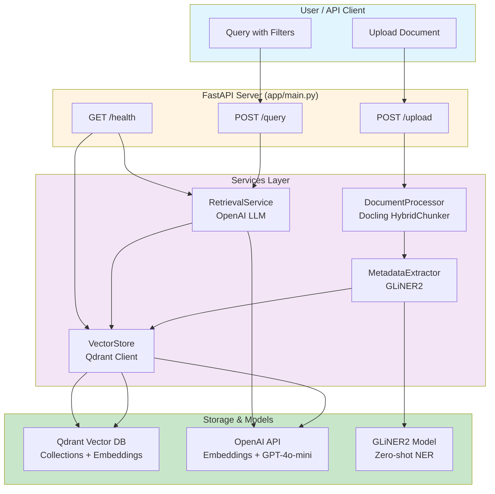

# System Architecture Overview

```mermaid
flowchart TB
    subgraph Client[User / API Client]
        A1[Upload Document]
        A2[Query with Filters]
    end

    subgraph FastAPI["FastAPI Server (app/main.py)"]
        B1[POST /upload]
        B2[POST /query]
        B3[GET /health]
    end

    subgraph Services["Services Layer"]
        C1[DocumentProcessor<br/>Docling HybridChunker]
        C2[MetadataExtractor<br/>GLiNER2]
        C3[VectorStore<br/>Qdrant Client]
        C4[RetrievalService<br/>OpenAI LLM]
    end

    subgraph Storage["Storage & Models"]
        D1[Qdrant Vector DB<br/>Collections + Embeddings]
        D2[OpenAI API<br/>Embeddings + GPT-4o-mini]
        D3[GLiNER2 Model<br/>Zero-shot NER]
    end

    A1 --> B1
    A2 --> B2

    B1 --> C1
    C1 --> C2
    C2 --> C3
    C3 --> D1
    C2 --> D3
    C3 --> D2

    B2 --> C4
    C4 --> C3
    C3 --> D1
    C4 --> D2

    B3 --> C3
    B3 --> C4

    style Client fill:#e1f5ff
    style FastAPI fill:#fff4e1
    style Services fill:#f3e5f5
    style Storage fill:#c8e6c9
```
