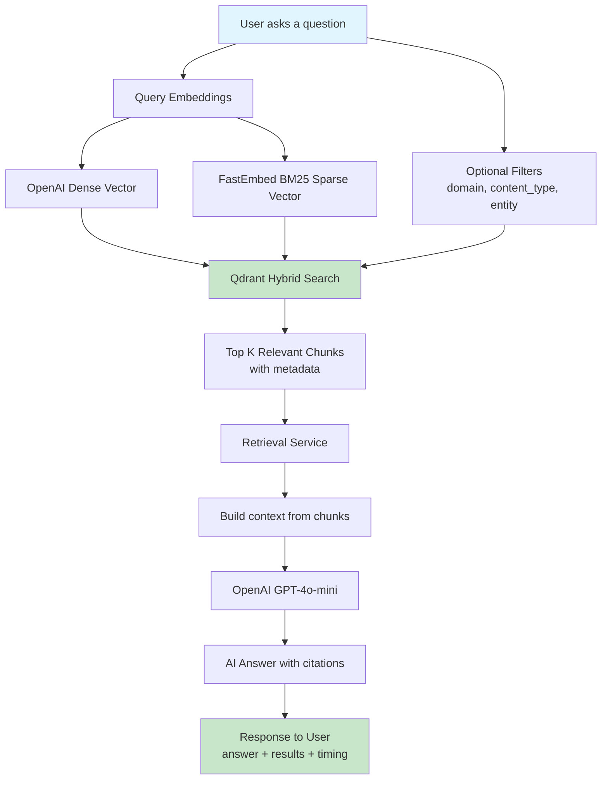

# Query Flow

```mermaid
flowchart TD
    A[User asks a question] --> B[Optional Filters<br/>domain, content_type, entity]

    A --> C[Query Embeddings]
    C --> D[OpenAI Dense Vector]
    C --> E[FastEmbed BM25 Sparse Vector]

    D --> F[Qdrant Hybrid Search]
    E --> F
    B --> F

    F --> G[Top K Relevant Chunks<br/>with metadata]

    G --> H[Retrieval Service]
    H --> I[Build context from chunks]

    I --> J[OpenAI GPT-4o-mini]
    J --> K[AI Answer with citations]

    K --> L[Response to User<br/>answer + results + timing]

    style A fill:#e1f5ff
    style F fill:#c8e6c9
    style L fill:#c8e6c9
```
