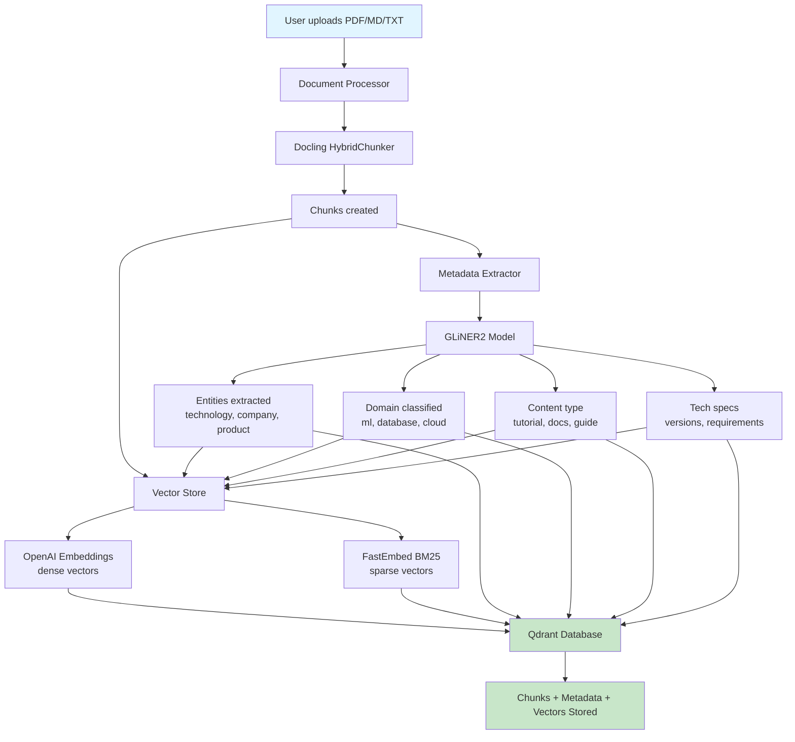

# Document Upload Flow

```mermaid
flowchart TD
    A[User uploads PDF/MD/TXT] --> B[Document Processor]
    B --> C[Docling HybridChunker]
    C --> D[Chunks created]

    D --> E[Metadata Extractor]
    E --> F[GLiNER2 Model]
    F --> G[Entities extracted<br/>technology, company, product]
    F --> H[Domain classified<br/>ml, database, cloud]
    F --> I[Content type<br/>tutorial, docs, guide]
    F --> J[Tech specs<br/>versions, requirements]

    D --> K[Vector Store]
    G --> K
    H --> K
    I --> K
    J --> K

    K --> L[OpenAI Embeddings<br/>dense vectors]
    K --> M[FastEmbed BM25<br/>sparse vectors]

    L --> N[Qdrant Database]
    M --> N
    G --> N
    H --> N
    I --> N
    J --> N

    N --> O[Chunks + Metadata + Vectors Stored]

    style A fill:#e1f5ff
    style N fill:#c8e6c9
    style O fill:#c8e6c9
```
