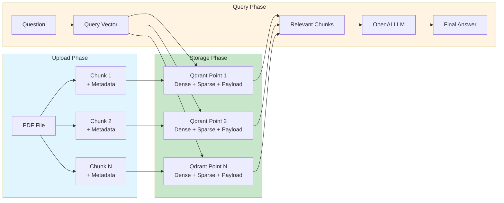

# Data Flow: Upload to Query

```mermaid
flowchart LR
    subgraph UploadPhase["Upload Phase"]
        A1[PDF File] --> A2[Chunk 1<br/>+ Metadata]
        A1 --> A3[Chunk 2<br/>+ Metadata]
        A1 --> A4[Chunk N<br/>+ Metadata]
    end

    subgraph StoragePhase["Storage Phase"]
        A2 --> B1[Qdrant Point 1<br/>Dense + Sparse + Payload]
        A3 --> B2[Qdrant Point 2<br/>Dense + Sparse + Payload]
        A4 --> B3[Qdrant Point N<br/>Dense + Sparse + Payload]
    end

    subgraph QueryPhase["Query Phase"]
        C1[Question] --> C2[Query Vector]
        C2 --> B1
        C2 --> B2
        C2 --> B3

        B1 --> D1[Relevant Chunks]
        B2 --> D1
        B3 --> D1

        D1 --> D2[OpenAI LLM]
        D2 --> D3[Final Answer]
    end

    style UploadPhase fill:#e1f5ff
    style StoragePhase fill:#c8e6c9
    style QueryPhase fill:#fff4e1
```
